# ProxyFair: Fairness-Aware Causal Discovery via Equivalence-Class Search

 

ProxyFair is a fairness-aware extension of Greedy Equivalence Search (GES) for causal graph learning. It embeds fairness directly into the score-based search — via an information-theoretic *proxy-excess fraction* penalty — while provably preserving the Markov equivalence class structure that makes GES theoretically sound. A two-phase design separates orientation-invariant penalization (Phase 1) from fair DAG extraction (Phase 2), enabling hard normative constraints and soft continuous penalties to coexist without breaking score equivalence.

```mermaid
flowchart LR
    A["Data + Prior Knowledge\n(blacklist / whitelist edges)"] --> B

    subgraph Phase1["Phase 1 — Score-Equivalent CPDAG Search"]
        B["Compute proxy-excess fractions\nπᴵ(i,j) via conditional MI\n[fairness_scoring.py]"]
        B --> C["Symmetric edge penalty Ψ_sym\n(orientation-invariant)\n[fairness_scoring.py]"]
        C --> D["Fair-BIC local score\nBIC − λ · N · Ψ_sym\n[ges_runner_causal_learn.py]"]
        D --> E["GES search on modified score\n→ CPDAG (equivalence class)\n[causal_learn fork]"]
    end

    subgraph Phase2["Phase 2 — Fair DAG Extraction"]
        F["Enumerate DAG extensions\nof the CPDAG"]
        F --> G["Rank by directed\nfairness penalty\n[counterfactual_fairness_runner.py]"]
        G --> H["Select fairest DAG\n→ fit SCM\n→ evaluate TE / NDE / PSE"]
    end

    E --> F
    H --> I["Fairness Report\n& LaTeX Tables"]
```



---

## Quick Start

**Requirements**: Python 3.11, [Poetry](https://python-poetry.org/)

```bash
git clone <repository-url>
cd <cloned-folder>
poetry install

# 1. Run the demo (< 2 minutes): vanilla GES vs ProxyFair on synthetic data
poetry run python examples/demo_proxyfair.py

# 2. Verify correctness: 8-module test suite
poetry run pytest tests/synthetic -q

# 3. Browse pre-computed paper tables without running any experiments
#    results/real_world/   — aggregate CSVs, per-attribute CSVs/Markdown tables, and Pareto plots
#    results/synthetic/    — timestamped run folders with CSV + LaTeX tables
```

---

## Pre-Computed Results

All paper tables are already generated and committed. No experiment needs to run to read them.

| Paper artifact | File |
|---|---|
| Table 1 — Synthetic single-attribute (φ sweep) | `results/synthetic/result1_*/result1_phi05_main_table.tex` |
| Table 2 — Synthetic displacement (multi-attribute) | `results/synthetic/displacement_*/displacement_main_table.tex` |
| Real-world per-attribute markdown tables (Law, COMPAS, Dutch, Bank) | `results/real_world/formatted_tables/*_per_attribute_table.md` |
| Real-world aggregate CSVs (Law, COMPAS, Dutch, Bank) | `results/real_world/aggregate/*_aggregate_results.csv` |
| Real-world per-attribute CSVs (Law, COMPAS, Dutch, Bank) | `results/real_world/per_attribute/*_per_attribute_results.csv` |
| COMPAS Pareto front data | `results/real_world/plots/pareto_scatter_data_compas.csv` |
---

## Algorithm Variants

Five variants are evaluated across all experiments, forming a systematic ablation:

| Variant | Phase 1 penalty | Phase 2 selection | What it isolates |
|---|---|---|---|
| `vanilla_ges` | None | None | GES baseline |
| `hard_constraints` | None (hard blacklist only) | None | Effect of normative constraints alone |
| `fair_mec_phase1` | Symmetric proxy penalty | None | Phase 1 fairness signal, no Phase 2 |
| `fair_mec_marginal_only` | Marginal proxy (no outcome relevance) | Directed penalty | Ablation: outcome relevance contribution |
| `fair_mec_full` | Symmetric proxy penalty | Directed penalty | **Full ProxyFair** |

---

## Repository Layout

```
src/faircausal/core/              # ProxyFair algorithm
  fairness_scoring.py               Phase 1 proxy-excess fractions and symmetric penalty
  ges_runner_causal_learn.py        GES orchestration with fair-BIC score
  counterfactual_fairness_runner.py Phase 2 DAG selection, SCM fitting, TE/NDE/PSE evaluation
  prior_knowledge_processor.py      Hard constraint matrices (blacklist / whitelist)
  lambda_selection.py               λ selection: grid search, elbow, normative anchoring
  causal_data_utils.py              Data preparation for GES and SCM fitting
  fairness_metrics.py               AIF360-based individual fairness evaluation
  ml_classifer_runner.py            Fairness audit via LR / RF / XGBoost / MLP

src/faircausal/causal_learn/      # Local causal-learn fork (modified GES scoring)
src/faircausal/data/              # Dataset loaders and synthetic data generators
  synthetic/archetype_definitions.py  Three synthetic archetypes (selective suppression,
                                       confounder, multi-attribute displacement)

src/experiments/                  # Experiment runners and analysis
  run_synthetic_main_grid.py        Grid sweeps over λ and proxy strength φ
  main_runner.py                    Real-world experiment pipeline
  synthetic_ges_runner.py           Single-run orchestrator (data → GES → metrics → CSV row)
  compile_causal_fairness_analysis_table.py  LaTeX table compilation
  plot_pareto_front.py              AUROC vs |TE|/|PSE| Pareto scatter plots
  configs/                          Per-dataset JSON configs (protected attrs, constraints)

tests/synthetic/                  # Test suite (8 modules)
results/                          # Pre-generated experiment outputs
data/                             # Preprocessed real-world datasets
```

---

## Core Algorithm Mapping

**Phase 1 — scoring primitives** (`src/faircausal/core/fairness_scoring.py`)
- `compute_edge_proxy_fractions(...)` — proxy-excess fraction $\pi^\Sigma(i,j)$ using conditional mutual information and marginal association
- `compute_outcome_relevance(...)` — static outcome relevance $\rho_{adj}(i)$ weighting edges by downstream outcome influence
- `compute_symmetric_penalty_from_pi(...)` — symmetric penalty $\Psi_{sym}(i,j) = \tfrac{1}{2}(\psi(i\to j) + \psi(j\to i))$, ensuring equivalent DAGs receive identical scores

**Phase 1 — constrained GES** (`src/faircausal/core/ges_runner_causal_learn.py`)
- `run_ges(...)` — integrates fair-BIC score into the local causal-learn fork; enforces hard blacklist / whitelist constraints

**Phase 2 — DAG selection and fairness analysis** (`src/faircausal/core/counterfactual_fairness_runner.py`)
- `select_fairest_dag(...)` — ranks CPDAG extensions by directed fairness penalty
- `analyze_all_dags_improved_flow(...)` — SCM fitting, synthetic counterfactual generation, TE / NDE / PSE computation

---

## Test Suite

Eight modules in `tests/synthetic/` provide correctness guarantees and regression coverage:

| Module | What it validates |
|---|---|
| `test_score_equivalence.py` | **Symmetric penalty is orientation-invariant**: all DAGs in a Markov equivalence class receive the same Phase 1 score — the core theoretical guarantee of ProxyFair |
| `test_calibration.py` | Proxy-strength monotonicity; calibration error < 5% for target φ; category diagnostics |
| `test_integration.py` | End-to-end: hard constraints, fairness constraints, temporal blacklists; learned graphs comply |
| `test_experiments.py` | Smoke tests for all 6 experimental modes; λ sweep configurations; ablation trends |
| `test_generation.py` | Synthetic data generation; archetype instantiation; structural correctness |
| `test_ges_phase2_only.py` | Phase 2 DAG selection in isolation; fairness ranking consistency |
| `test_compile_causal_fairness_analysis_table.py` | Table compilation; column formatting; LaTeX output correctness |
| `test_statistical_tests.py` | Significance testing utilities used across experiments |

```bash
poetry run pytest tests/synthetic -q
```

---

## Reproducing Paper Artifacts

### Table 1 (Synthetic single-attribute)

```bash
poetry run python src/experiments/run_synthetic_main_grid.py --mode result1 --n-jobs -1
```

### Table 2 (Synthetic displacement)

```bash
poetry run python src/experiments/run_synthetic_main_grid.py --mode displacement --n-jobs -1
```

### Real-world runs (Law, COMPAS, Dutch, Bank)

```bash
pwsh -File scripts/run_all_real_datasets.ps1
```

### Compile causal-fairness tables from completed runs

```bash
poetry run python src/experiments/compile_causal_fairness_analysis_table.py --dataset law
poetry run python src/experiments/compile_causal_fairness_analysis_table.py --dataset compas
poetry run python src/experiments/compile_causal_fairness_analysis_table.py --dataset dutch
poetry run python src/experiments/compile_causal_fairness_analysis_table.py --dataset bank
```

### Pareto plots (COMPAS)

```bash
pwsh -File scripts/run_compas_pareto_grid.ps1
poetry run python src/experiments/plot_pareto_front.py --dataset compas
```

---

## Full Setup

### Prerequisites

- Python 3.11
- Poetry

### Install

```bash
git clone <repository-url>
cd <cloned-folder>
poetry install
poetry run python --version
```

### Run Tests

```bash
poetry run pytest tests/synthetic -q
```

---

## Notes on LLM Constraint Elicitation

`src/faircausal/llm/` contains optional tooling for automated role elicitation and constraint generation used in some experiments. ProxyFair does not require LLM inference at runtime when constraints are provided via the JSON config.

```bash
poetry run python -m src.faircausal.llm.fairness_framework_analysis --dataset bank
```
